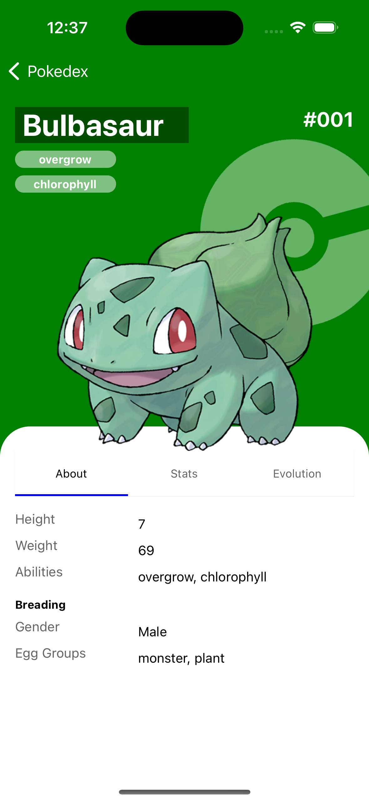
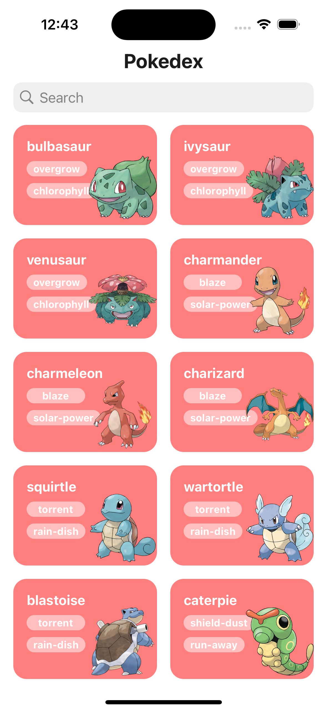
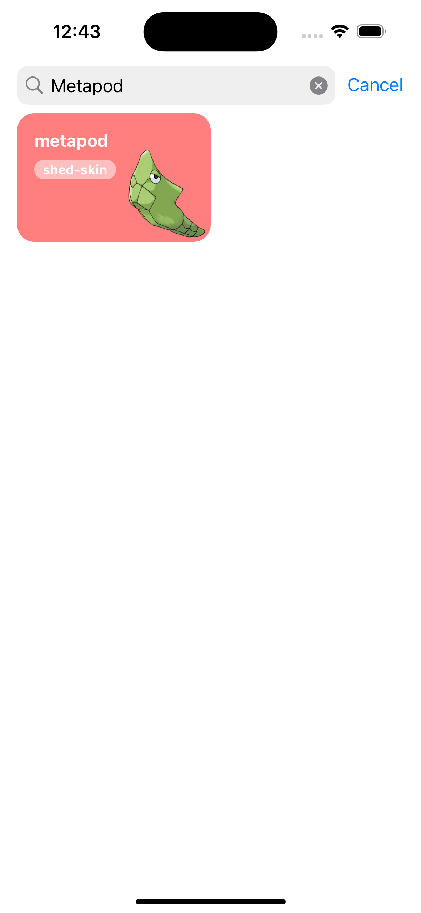
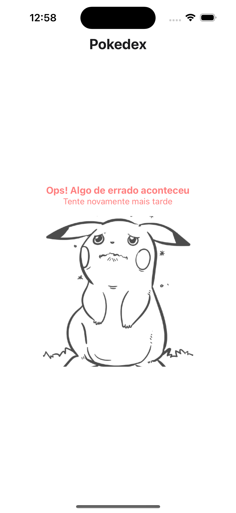
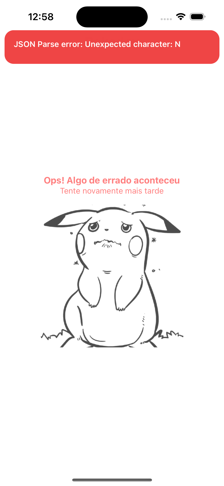

# Pokémon App

A React Native application built with Expo that displays Pokémon information using the PokéAPI.

## Screenshots

| Home Screen                                   | Detail Screen                                       |
| --------------------------------------------- | --------------------------------------------------- |
|  |        |
| Home Screen with search                       | Screen with search                                  |
| --------------------------------              | --------------------------------                    |
|     |            |
| Error Screen                                  | Error Screen with toast                             |
| --------------------------------              | --------------------------------                    |
|   |  |

## Prerequisites

Before you begin, ensure you have the following installed:

- [Node.js](https://nodejs.org/) (version 16 or higher)
- [npm](https://www.npmjs.com/) or [yarn](https://yarnpkg.com/)
- [Expo CLI](https://docs.expo.dev/get-started/installation/)
- [Expo Go](https://expo.dev/client) app installed on your mobile device

## Installation

1. Clone the repository:

git clone <repository-url>
cd pokemon-app

2. Install dependencies:

npm install

# or

yarn install

## Running the App

1. Start the development server:

```bash
npx expo start
```

# or

```bash
yarn expo start
```

## Project Structure

```
src/
├── presentation/
│ ├── hooks/
│ │ ├── useDebounce.ts
│ │ ├── useDetailVm.ts
│ │ └── useHomeVm.ts
│ └── screens/
│ ├── home/
│ │ ├── index.tsx
│ │ └── ...
│ └── details/
│ ├── index.tsx
│ ├── detailRow.tsx
│ └── tabs/
│ ├── about/
│ ├── evolution/
│ └── stats/
│ ├── index.tsx
│ └── ...
├── services/
│ ├── httpService.ts
│ └── pokemonService.ts
├── ...
├── models/
│ ├── pokemon.model.ts
│ └── pokemonDetail.model.ts
├── components/
│ ├── common/
│ │ ├── loading.tsx
│ │ ├── errorBoundary.tsx
│ │ └── searchInput.tsx
│ └── pokemon/
│ ├── pokemonCard.tsx
│ └── pokemonList.tsx
├── styles/
│ ├── colors.ts
│ ├── spacing.ts
│ └── typography.ts
├── utils/
│ ├── formatters.ts
│ └── validators.ts
├── constants/
│ └── appConstants.ts
└── injectionContainer.ts

```

## Features

- Browse Pokémon list with infinite scroll
- Search Pokémon by name with debounce
- Detailed Pokémon view with tabs:
  - About information
  - Evolution chain
  - Stats visualization
- Responsive design for various screen sizes

## Development Setup

### Editor Configuration

The project uses specific formatting rules. Make sure you have the following files in your project:

1. .editorconfig:

   - Ensures consistent coding styles across different editors
   - Sets 2-space indentation
   - Manages line endings and file formatting

2. .prettierrc:

   - Configures code formatting rules
   - Enforces consistent code style

3. VS Code Settings (.vscode/settings.json):
   - Configures editor-specific settings
   - Enables format on save
   - Sets Prettier as the default formatter

### Required VS Code Extensions

- ESLint
- Prettier
- EditorConfig for VS Code

## API Integration

This project uses the PokéAPI (https://pokeapi.co/) for fetching Pokémon data, including:

- Basic Pokémon information
- Evolution chains
- Stats and abilities

## Troubleshooting

If you encounter any issues:

1. Clear Metro bundler cache:

npx expo start -c

2. Reset Expo cache:

expo r -c

3. Common issues:
   - Metro bundler port conflicts: Use 'npx expo start --port 19001'
   - Node modules issues: Delete 'node_modules' and run 'npm install'
